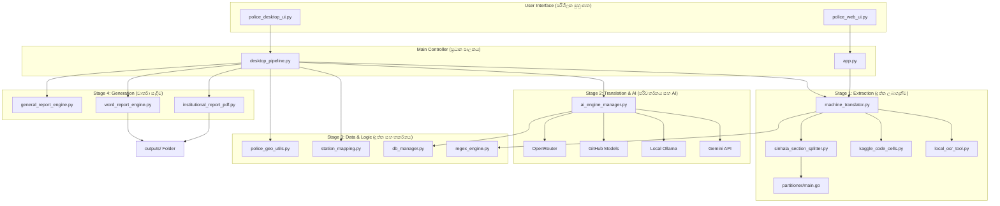

# Complete System Architecture & Workflow

This document explains the technical flow of the PDF Convert Tool and how all files work together.

## 🏗 High-Level Architecture Diagram

---

## 📖 ක්‍රියාකාරී වැඩපිළිවෙල (Workflow Explanation in Sinhala)

මෙම පද්ධතිය ප්‍රධාන පියවර 4ක් ඔස්සේ ක්‍රියාත්මක වේ:

### 1. දත්ත ලබාගැනීම (Extraction Stage)
මුලින්ම ඔබ ලබාදෙන PDF ගොනුව `machine_translator.py` මගින් කියවනු ලබයි. මෙහිදී:
- PDF එකේ ඇති සිංහල අකුරු හඳුනා ගැනීමට **Gemini Vision** හෝ **Local OCR** (`local_ocr_tool.py`) භාවිතා කරයි.
- ඉතා විශාල වාර්තා වැඩ වලදී **Kaggle GPU** (`kaggle_code_cells.py`) පවා භාවිතා කළ හැක.
- ලබාගත් සම්පූර්ණ ලිපිය `sinhala_section_splitter.py` සහ `partitioner` (Go module) මගින් නිවැරදිව පොලිස් වාර්තා වර්ග 29 ට වෙන් කරනු ලබයි.

### 2. බුද්ධිමත් පරිවර්තනය (AI Translation Stage)
මෙය පද්ධතියේ වඩාත්ම වැදගත් කොටසයි. මෙහිදී `ai_engine_manager.py` පර්වතක ක්‍රමවේදයක් (Round-Robin) භාවිතා කරයි:
- එකවර AI engines කිහිපයක් (Gemini, ChatGPT, Ollama) ක්‍රියාත්මක කරමින් දත්ත වේගයෙන් පරිවර්තනය කරයි.
- සිංහලෙන් ඇති විස්තර ඉංග්‍රීසියට හැරවීමේදී පොලිස් ස්ථාන (`station_mapping.py`) සහ භූගෝලීය දත්ත (`police_geo_utils.py`) ස්වයංක්‍රීයව නිවැරදි කරයි.
- කිසියම් AI එකක් අසාර්ථක වුවහොත්, ස්වයංක්‍රීයව තවත් AI එකකට මාරු වී වැඩේ සම්පූර්ණ කරයි.

### 3. දත්ත ගබඩා කිරීම සහ පිරිපහදු කිරීම (Data Logic)
- සියලුම පරිවර්තනය වූ විස්තර `db_manager.py` මගින් `police_reports.db` යන දත්ත ගබඩාවේ (Database) සුරක්ෂිතව තැන්පත් කරයි.
- මේ හරහා ඔබට පැරණි වාර්තා නැවත ලබා ගැනීමට (History) හැකියාව ලැබේ.

### 4. අවසාන වාර්තා සෑදීම (Report Generation)
සියලු වැඩ නිම වූ පසු පද්ධතිය මගින් Professional තත්ත්වයේ වාර්තා සාදනු ලබයි:
- **PDF වාර්තා**: `institutional_report_pdf.py` මගින් නිල මුද්‍රිත පෙනුම සහිත (Official formatting) PDF සාදයි.
- **Word වාර්තා**: `word_report_engine.py` මගින් ඔබට පසුව සංස්කරණය කළ හැකි (Editable) ලේඛන සාදයි.
- මේ සියල්ල අවසානයේ `outputs/` folder එක තුල ඔබට දැකගත හැක.

---

## 🛠 පද්ධතිය පවත්වාගෙන යාම (System Maintenance)
- **API Health Check**: `audit_api_health.py` මගින් සේවාවන් ඔන්ලයින් දැයි පරීක්ෂා කළ හැක.
- **Setup**: `install_and_setup.bat` මගින් ඕනෑම පරිගණකයකට මෙය පහසුවෙන් ස්ථාපනය කළ හැක.
- **Verification**: `verify_project_az.py` මගින් පද්ධතියේ කිසියම් දෝෂයක් ඇත්දැයි ඕනෑම වෙලාවක පරීක්ෂා කළ හැක.
